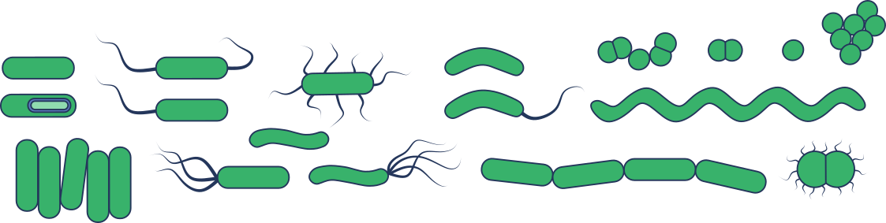
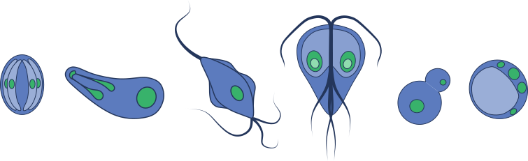
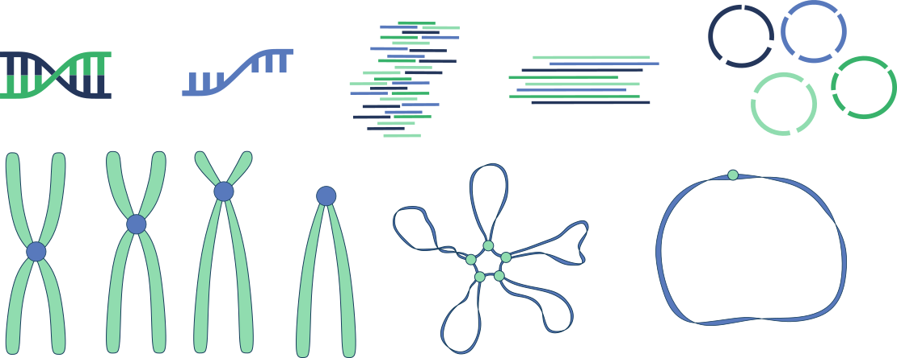
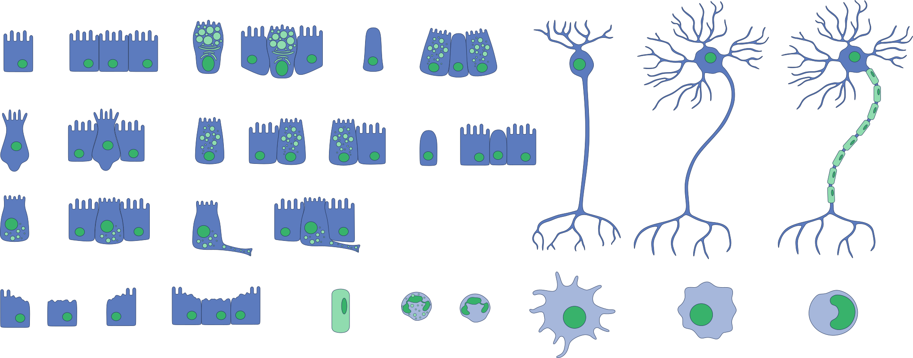
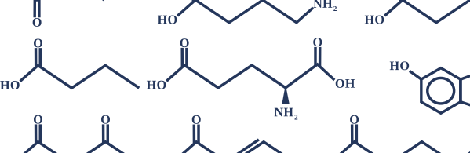

# SVGBank
Open source repository of publication grade biomedical research related SVGs. Mostly gut related, but I'm working on expanding things (making art takes time :( ).

SVGBank is currently being expanded bi-weekly, and is open to external contributions. If you would like to contribute, please reach out!

## Current Catalogue 
_____________________________________________________________________________

### Bacteria 

_____________________________________________________________________________

### Eukaryotes

_____________________________________________________________________________

### Nucleic Acids

_____________________________________________________________________________

### Human Cells

_____________________________________________________________________________

### Chemicals

_____________________________________________________________________________

### Lab Equipment

