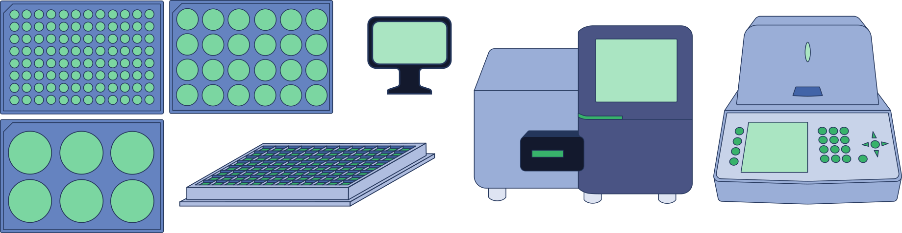

# SVGBank
Open source repository of publication grade biomedical research related SVGs. 

SVGBank is currently being expanded bi-weekly, and is open to external contributions. If you would like to contribute, please reach out!

## Current Catalogue 

### Bacteria 

### Eukaryotes

### Nucleic Acids

### Human Cells

### Chemicals

### Lab Equipment

